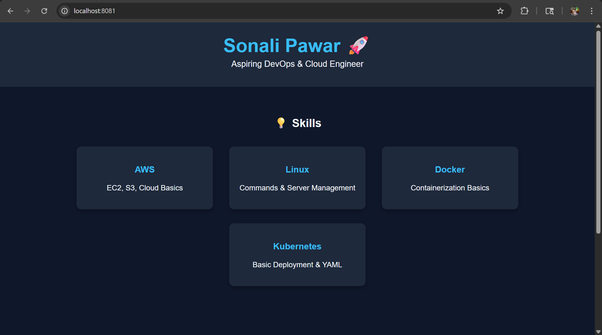

# Docker Portfolio Website 🚀

## 📌 Overview
This project demonstrates containerizing a personal portfolio website using Docker and Nginx.

## ⚙️ Steps Performed
- Created a responsive portfolio website using HTML & CSS
- Built a Docker image using Nginx
- Deployed the application in a container
- Exposed the application on localhost

## 🛠️ Technologies Used
- Docker
- Nginx
- HTML
- CSS

## 🌐 Output
Accessible at: http://localhost:8081

## 📂 Project Structure
- index.html
- Dockerfile
  
## 📸 Output Screenshot

## 👩‍💻 Author
Sonali Pawar

